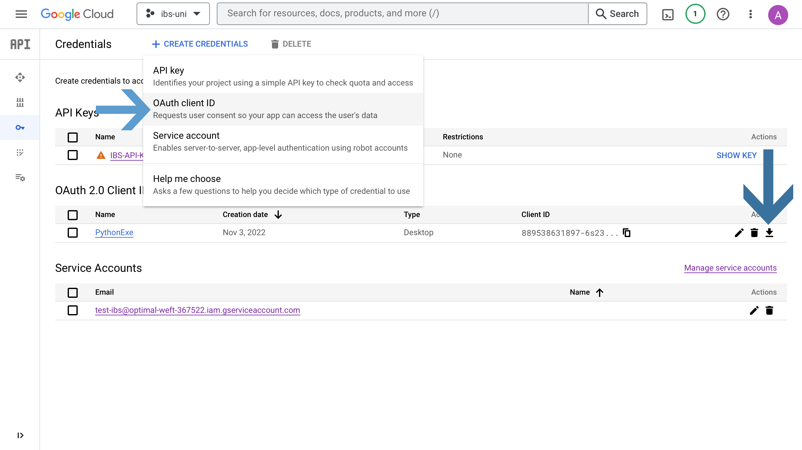

**Automation Home Assignment**
**Alireza Bolhassani**
**Date : Nov 2022**

# Step by Step Instruction

After you clone the git on your system you can follow steps below:

1. copy credentials into json folder( you need to create project in google cloud account and create credentials OAuth 2 from project page and download json file and paste into app folder)



2. Install dependency : I listed all of dependency in a file. Install dependency by run code below (you need run this code from your application folder):

   ```
   pip install -r requirements.txt
   ```

3. If you run the app.py, you can see it create a "TopRanks" spreadsheet in google drive and a script file.

   - you need to run script and give the necessary permissions.
   - if you remove TopRanks from your google drive make sure you remove it from trash.

4. It create spreadsheet in google drive and every month that code run based on scheduale it create new form and save the response of form inside a spreadsheet. You can see average and every vote in detail.

# Last Step Scheduling

in crontab -e add command below:

```
0 0 1 \* \* python3 <the address of your python code /app.py>
```

# Project Structure

- crawl/Billboard.py

  Inside this file, a class is defined that is responsible for getting information.

- googleapi/

  - authentication.py
    Authentication and authorization are mechanisms used to verify identity and access to resources, respectively.

  - drive.py & form.py & script.py & sheet.py
    Provide some basic function that you need to work with googleapi.

- json/
  you need to paste your credentials.json file in this folder and replace with current file.
  token.json create when you run for the first time and give it the permissions.

- gs/
  AppScript file store here. It is automatically uploaded to Google Drive and you need to run it once and give it the necessary permissions.

# App Script Structure

in app script, I define 2 trigger in my code. The first trigger run every time spreadsheet changed and second trigger run every time form submited.

every month one row add to the end of spreadsheet and based on last row information it create new form and also create a spreadsheet for save the responses and calculate average.
